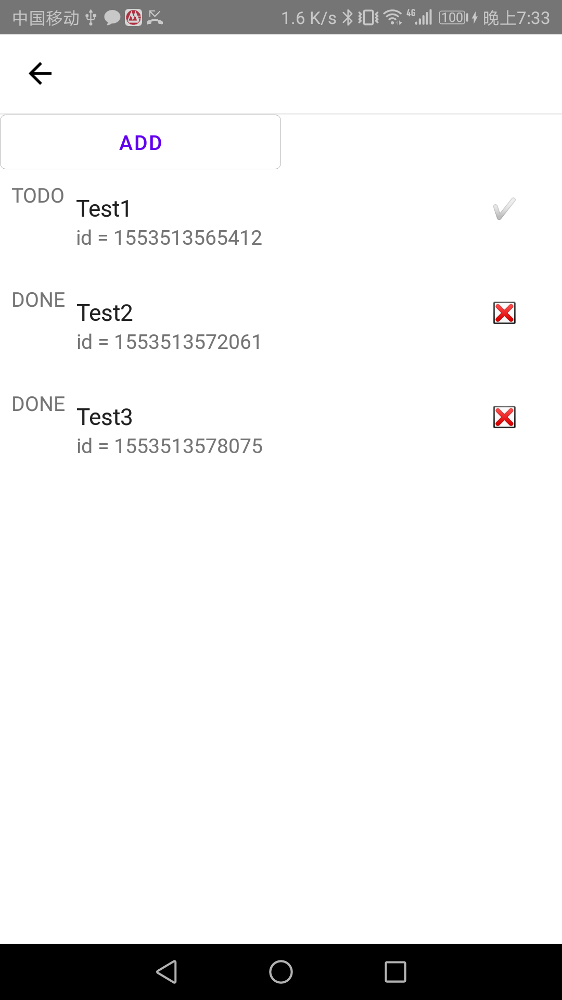

<h1 align="center">MaxieeRNLab</h1>

  My React Native learning experiences 
  Awesome React Native demos.

MaxieeRNLab is my learning experiences of React Native. This project includes many aspect of developing a React
 Native:

- A better understand of React Native Framework
  - Yoga layout engine
  - BatchedBridge message queue
- React Navigation with react-navigation
  - stack navigator
  - material top tab navigator
  - custom bottom navigation with center button
- Redux
  - Todo demo
- UI
  - usage of react-native-paper
  - usage of react-native-elements

## Screenshots

|HomePage|Yoga Layout Engine|Stack Navigator|
|--|--|---|
||||
|Redux Todo 1|Redux Todo 2|Custom Bottom Navigator|
||||
|Material Top Tab|Image|Buttons|
||||
|Chat Demo|Line Chart Demo||
||||